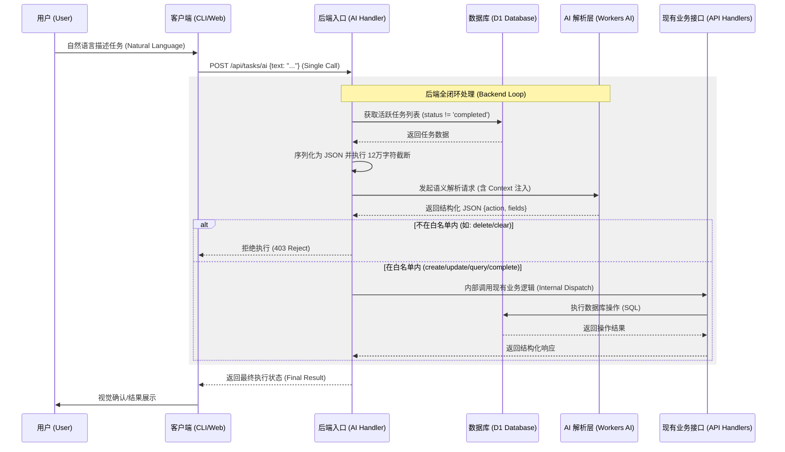

# AI 语义任务处理 (AI-Powered Task Parsing) 需求说明书

## 1. 需求背景
目前用户通过 CLI 或 Web 界面添加任务需要手动输入标题、截止日期、提醒时间等结构化参数。为了进一步提升效率，计划在后端引入 AI 处理层，使用户能够通过自然语言描述任务并实现自动执行。

## 2. 核心目标
- **后端全闭环执行**：解析（Parsing）与执行（Execution）均在后端完成。客户端发起单一请求，后端返回最终执行结果。
- **直接执行（免审核）**：用户发起请求后，后端解析并立即执行相应的业务逻辑，无需用户二次确认，实现极简体验。
- **复用已有逻辑**：AI 解析出的结构化结果在后端内部直接调用现有的 API 处理函数（Handlers），确保校验逻辑、时区转换与普通接口完全一致。
- **安全白名单控制**：在后端调用具体业务逻辑之前，先实施操作白名单（Whitelist）校验，仅允许非敏感操作（如增、查、改）。
- **透明审计**：任务的 `metadata` 字段必须记录审计快照。其中应包含用户输入的**原始 Prompt**、**AI 解析出的原始 JSON 结果**以及处理时间戳。

## 3. 功能需求

### 3.1 语义处理接口 (`POST /api/tasks/ai`)
后端新增专用 AI 处理入口，其内部处理逻辑如下：
1. **接收输入**：接收客户端发送的原始文本 `text`。
2. **AI 解析**：调用 AI 模型将文本转换为结构化数据及建议的操作类型（Action）。
3. **白名单校验**：后端根据解析出的 Action 立即进行安全性判断。
    - **不在白名单内**：直接拒绝执行并返回错误响应。
    - **在白名单内**：继续后续流程。
4. **内部逻辑调用**：将解析出的结构化数据封装，直接调用对应的已有 API Handler 函数。
5. **持久化审计**：在执行数据库操作时，将原始文本和解析出的 JSON 结构封装进 `metadata.ai_context` 字段中。
6. **返回结果**：向客户端返回最终的执行状态（成功或失败的原因）。

### 3.2 操作流转逻辑
1. **用户输入**：在终端执行 `claw-task ai "帮我查询明天的提醒"`。
2. **客户端调用**：CLI 发起一次 `POST /api/tasks/ai` 请求，携带原始文本。
3. **后端闭环处理**：
    - 后端解析出：`action: "query"`, `date: "2026-03-06"`。
    - 后端通过白名单校验后，内部调用查询接口逻辑并获取结果。
4. **响应结果**：CLI 接收到查询结果并直接展示。

对于创建操作：
1. **用户输入**：执行 `claw-task ai "明天下午三点提醒我喝水"`。
2. **后端闭环处理**：
    - 解析出任务详情及 `action: "create"`。
    - 后端通过白名单校验后，内部调用创建接口逻辑，同时将包含 `original_prompt` 和 `raw_parse_result` 的对象存入 `metadata.ai_context`。
3. **响应结果**：CLI 展示“任务已成功创建：[喝水] @ [2026-03-06 15:00:00]”。

### 3.3 触发与安全限制
- **操作白名单 (Whitelist)**：
    - ✅ **允许通过 AI 触发**：创建任务 (`create`)、更新任务属性 (`update`)、查询任务 (`query`)、标记完成 (`complete`)。
    - ❌ **严禁通过 AI 触发**：删除任务 (`delete`)、清空数据、修改核心配置。
- **预拦截机制**：若 AI 解析出的操作类型不在白名单内，后端在调用任何写操作或查询逻辑前必须予以拦截。

## 4. 技术方案建议

### 4.1 AI 模型选择
- **Cloudflare Workers AI**：利用平台原生的 `llama-3` 系列模型。

### 4.2 数据流转路径


## 5. 安全与隐私
- **内部隔离**：解析接口本身不具备数据库访问权限，必须通过已有的、受过验证的业务接口进行交互。
- **速率限制**：针对 `/api/tasks/ai` 设置独立的 Rate Limit。

## 6. 系统提示词 (System Prompt)
后端在调用 AI 模型时，使用了以下经过深度优化的系统提示词。该 Prompt 动态注入了系统当前的分类、标签及实时时间，以确保解析的准确性和上下文关联性：

```text
You are an AI assistant for a task management system.
Your goal is to parse natural language input into a structured JSON action.
Current Date/Time: {localTime} ({userTimezone}).

Available Categories: {categories}
Available Tags: {existingTags}

Supported Actions and Parameters:
1. create: Create a new task.
   - title (string, required): Task title.
   - description (string): Detailed description.
   - priority (low, medium, high): Default is 'medium'.
   - category_id (number): Use the ID from the list above.
   - due_date (YYYY-MM-DD HH:mm:ss): Deadline.
   - remind_at (YYYY-MM-DD HH:mm:ss): Reminder time.
   - recurring_rule (none, daily, weekly, monthly): Repetition frequency.
   - tags (string array): Names of tags to associate.

2. update: Update an existing task.
   - id (number, required): The ID of the task to update.
   - title, description, priority, category_id, due_date, remind_at, recurring_rule, tags: Same as 'create'.
   - status (pending, completed): Change task status.

3. query: Search for tasks.
   - q (string): Search text in title or description.
   - status (pending, completed): Filter by status.
   - priority (low, medium, high): Filter by priority.
   - tag_name (string): Filter by a single tag name.
   - category_id (number): Filter by category ID.
   - due_date (YYYY-MM-DD): Filter by tasks due on this specific date.
   - remind_at (YYYY-MM-DD): Filter by tasks with a reminder on this specific date.
   - has_remind (string: "true" or "false"): Use "true" to find tasks that HAVE any reminder set, "false" for those that don't.
   - has_due (string: "true" or "false"): Use "true" to find tasks that HAVE any due date set, "false" for those that don't.

4. complete: Mark a task as completed.
   - id (number, required): The ID of the task.

Return ONLY a JSON object with "action" and "fields" keys.
Action MUST be one of: create, update, query, complete.

Response Format Example:
{
  "action": "query",
  "fields": {
    "has_remind": "true",
    "status": "pending"
  }
}

Important Instructions:
1. If the user asks for tasks with reminders (e.g., "有提醒的任务"), use action "query" with "has_remind": "true".
2. If the user provides a short phrase that sounds like a task or a test (e.g., "测试 AI 功能"), prefer "create" with that phrase as the title.
3. For dates/times, resolve relative terms (like "tomorrow", "next Monday") based on the Current Date/Time.
4. If a task ID is mentioned, ensure it's mapped to the "id" field.
```

## 7. 模糊意图与上下文关联 (Fuzzy Intent & Context)
为了支持模糊的修改意图（如“把刚才那个任务改成明天”），系统采用 **“增强上下文注入 (Scheme A)”** 方案。

### 7.1 上下文注入机制
在每次调用 AI 解析之前，后端将自动检索 **所有未完成 (status != 'completed')** 的任务作为静态上下文注入 Prompt：
- **排除字段**：注入时必须剔除 `metadata` 及其内部的 `ai_context` 字段，以节省 Token 并减少干扰。
- **任务字段定义**：仅包含 `id`, `title`, `description`, `priority`, `due_date`, `remind_at`, `status`。
- **长度约束与截断逻辑**：
    1. **设定安全阈值**：基于 `glm-4.7-flash` 的 131,072 Tokens 限制，为任务上下文预留约 **80,000 Tokens** 的安全空间（折合中英混合文本约 **120,000 字符**），以确保留有充足空间处理系统提示词、用户输入及模型输出。
    2. **全量获取**：后端首先检索所有状态非 `completed` 的任务。
    3. **自适应截断**：后端将查询到的所有未完成任务（按 `updated_at` 降序排列）序列化为文本块。若序列化后的总长度 **超出 120,000 字符**，则直接在末尾截断。由于采用了降序排列，这种截断方式能自然且高效地保留时间上最相关的任务。

### 7.2 模糊意图处理流程
1. **获取数据**：后端执行 `SELECT id, title, description, priority, due_date, remind_at, status FROM tasks WHERE status != 'completed' ORDER BY updated_at DESC`。
2. **格式化与截断**：将任务列表序列化为 **JSON 字符串**。若结果总长度超过 120,000 字符，则直接截取前 120,000 个字符。
3. **注入 Prompt**：将处理后的 JSON 文本块放入 System Prompt 的 `### Context: Active Tasks` 部分。
4. **AI 推理**：AI 根据用户输入的模糊指代（如标题关键词、最近操作逻辑），从上下文中匹配对应的 `id`。
5. **生成指令**：AI 直接返回标准的 `update` 操作 JSON，其中包含匹配到的任务 `id`。

---
**状态**: 已完成 (Phase 1 & 5)
**创建时间**: 2026-03-05
**最后更新**: 2026-03-05 22:35:00 (接入 Telegram Webhook 作为 AI 语义输入的 IM 渠道；同步优化聊天窗排版)
---
