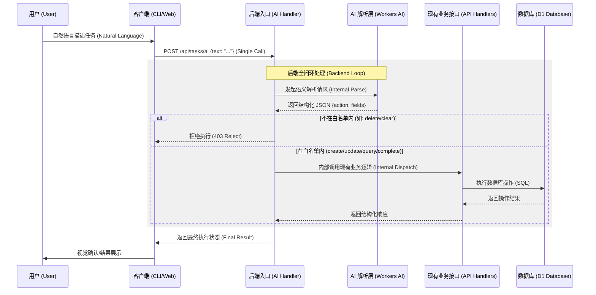

# AI 语义任务处理 (AI-Powered Task Parsing) 需求说明书

## 1. 需求背景
目前用户通过 CLI 或 Web 界面添加任务需要手动输入标题、截止日期、提醒时间等结构化参数。为了进一步提升效率，计划在后端引入 AI 处理层，使用户能够通过自然语言描述任务并实现自动执行。

## 2. 核心目标
- **后端全闭环执行**：解析（Parsing）与执行（Execution）均在后端完成。客户端发起单一请求，后端返回最终执行结果。
- **直接执行（免审核）**：用户发起请求后，后端解析并立即执行相应的业务逻辑，无需用户二次确认，实现极简体验。
- **复用已有逻辑**：AI 解析出的结构化结果在后端内部直接调用现有的 API 处理函数（Handlers），确保校验逻辑、时区转换与普通接口完全一致。
- **安全白名单控制**：在后端调用具体业务逻辑之前，先实施操作白名单（Whitelist）校验，仅允许非敏感操作（如增、查、改）。
- **透明审计**：任务的 `metadata` 字段必须记录审计快照。其中应包含用户输入的**原始 Prompt**、**AI 解析出的原始 JSON 结果**以及处理时间戳。

## 3. 功能需求

### 3.1 语义处理接口 (`POST /api/tasks/ai`)
后端新增专用 AI 处理入口，其内部处理逻辑如下：
1. **接收输入**：接收客户端发送的原始文本 `text`。
2. **AI 解析**：调用 AI 模型将文本转换为结构化数据及建议的操作类型（Action）。
3. **白名单校验**：后端根据解析出的 Action 立即进行安全性判断。
    - **不在白名单内**：直接拒绝执行并返回错误响应。
    - **在白名单内**：继续后续流程。
4. **内部逻辑调用**：将解析出的结构化数据封装，直接调用对应的已有 API Handler 函数。
5. **持久化审计**：在执行数据库操作时，将原始文本和解析出的 JSON 结构封装进 `metadata.ai_context` 字段中。
6. **返回结果**：向客户端返回最终的执行状态（成功或失败的原因）。

### 3.2 操作流转逻辑
1. **用户输入**：在终端执行 `claw-task ai "帮我查询明天的提醒"`。
2. **客户端调用**：CLI 发起一次 `POST /api/tasks/ai` 请求，携带原始文本。
3. **后端闭环处理**：
    - 后端解析出：`action: "query"`, `date: "2026-03-06"`。
    - 后端通过白名单校验后，内部调用查询接口逻辑并获取结果。
4. **响应结果**：CLI 接收到查询结果并直接展示。

对于创建操作：
1. **用户输入**：执行 `claw-task ai "明天下午三点提醒我喝水"`。
2. **后端闭环处理**：
    - 解析出任务详情及 `action: "create"`。
    - 后端通过白名单校验后，内部调用创建接口逻辑，同时将包含 `original_prompt` 和 `raw_parse_result` 的对象存入 `metadata.ai_context`。
3. **响应结果**：CLI 展示“任务已成功创建：[喝水] @ [2026-03-06 15:00:00]”。

### 3.3 触发与安全限制
- **操作白名单 (Whitelist)**：
    - ✅ **允许通过 AI 触发**：创建任务 (`create`)、更新任务属性 (`update`)、查询任务 (`query`)、标记完成 (`complete`)。
    - ❌ **严禁通过 AI 触发**：删除任务 (`delete`)、清空数据、修改核心配置。
- **预拦截机制**：若 AI 解析出的操作类型不在白名单内，后端在调用任何写操作或查询逻辑前必须予以拦截。

## 4. 技术方案建议

### 4.1 AI 模型选择
- **Cloudflare Workers AI**：利用平台原生的 `llama-3` 系列模型。

### 4.2 数据流转路径

## 5. 安全与隐私
- **内部隔离**：解析接口本身不具备数据库访问权限，必须通过已有的、受过验证的业务接口进行交互。
- **速率限制**：针对 `/api/tasks/ai` 设置独立的 Rate Limit。

---
**状态**: 待讨论
**创建时间**: 2026-03-05
**最后更新**: 2026-03-05 (根据纠错修订：明确调用已有接口及前置白名单拦截)
