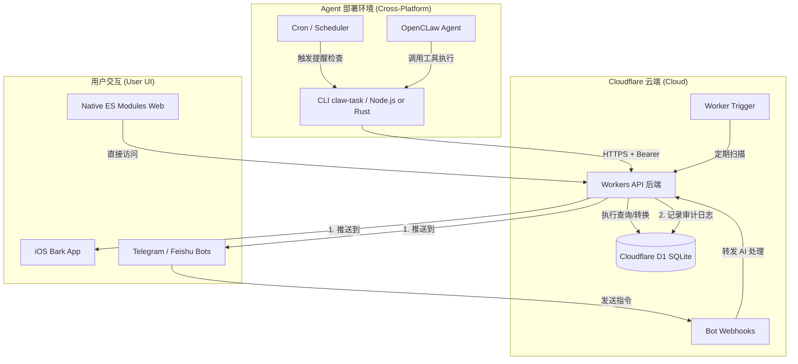

# 技术架构文档

## 系统架构图

## 核心设计规范

### 1. 跨平台 CLI (Node.js / Rust Binary)
- **双模运行**: 支持原生 Node.js 运行，或通过 **Rust** 编译为原生二进制以获得极速启动体验。
- **无 GUI 依赖**: 不调用特定 OS 的通知脚本。
- **Agent 通信**: 通过标准输出 (`stdout`) 返回结构化数据或调用 OpenCLaw 的 `system.notify` 接口。
- **高性能构建**: 使用 `cargo build --release` 实现零依赖分发，原生编译性能。
- **静默升级机制 (Rust专属)**: 
  - 在常规命令执行结束后，触发**脱离主进程 (detached process)** 的轻量级后台更新检查（利用本地临时文件控制每日限流一次）。
  - **实现细节与避坑**:
    - **API 权限**: 依赖 GitHub Releases API (`/releases/latest`)，要求代码仓库**必须为公开 (Public)** 才能进行匿名检查；私有仓库会返回 404 导致检测静默失效。
    - **生命周期**: 类似 `--version` / `-V` 这样的 CLI 短路参数会被解析器 (Clap) 提前拦截并退出进程，不会执行到 `main()` 尾部的后台检测代码。只有执行真正的业务命令（如 `list`、`info` 等）才能触发检测和输出提示。
    - **版本同步**: 程序内嵌版本取自编译时的 `CARGO_PKG_VERSION`，因此在跨栈发布流程中，必须严格确保 `Cargo.toml` 的版本与项目 Release 标签一致。
  - 通过比对 GitHub Releases 与本地 `semver` 版本号，在后续正常命令的执行末尾输出非阻塞式的更新提示。
  - 提供 `upgrade` 子命令，利用 `self-replace` 库自动下载对应操作系统的二进制产物，实现无缝安全的热替换升级。

### 2. 双触发机制 (Separated Trigger)
- **Agent Channel**: 本地触发，由 API 返回到期任务列表，本地完成通知。
- **Cloud Channel**: 云端触发，由 Worker 直接调用 Bark API 发送 iOS 推送。

### 3. AI 友好性组件
- **`/api/info`**: 提供 Schema 和配置的自发现。
- **CLI 发现与输出**: 移除对 `--help` 的环境依赖，加入全局 `--json` 输出参数以避免控制台排版对 AI 提取数据的干扰。
- **Metadata 处理器**: 在 API 层对任务的 `metadata` (JSON) 字段进行序列化与反序列化。
- **语义化搜索**: 在 D1 层通过关键词匹配 (`LIKE`) 支撑搜索能力。

### 4. 日志记录与滚动清理 (Audit Logs)
- **记录机制**: 在 Bark 成功推送后，Worker 会捕获请求的完整 URL（payload）并存入 `bark_logs` 表，记录推送到秒级的 UTC 时间。
- **自动清理**: 为了控制数据库体积，系统在每次执行 `cloud` 频道的提醒检查时，会自动触发一次 `DELETE` 操作，移除所有超过 7 天前的历史日志。
- **查询优化**: 为 `pushed_at` 字段建立索引，确保大偏移量下的查询性能及清理效率。

### 5. 存储与转换 (Timezone & Normalization)
- **存储规范**: 数据库 (D1) 强制存储标准的 **ISO UTC** 时间戳字符串。
- **强制标准化 (Ingress Control)**:
  - **正则校验**: 使用扩展正则表达式支持 `T` 或 `空格` 作为日期时间的分隔符，并允许时区标识符为可选。
  - **时区补全 (服务端基准)**: 对于不带时区的字符串，系统根据 **服务端 Worker 的 `USER_TIMEZONE` 配置** 进行时区识别（缺省为北京时间）。这意味着即便客户端与服务端时区不一致，存储结果也始终以服务端定义的时区为准进行校准。
  - **强制转换**: 在执行 `INSERT/UPDATE` 前，后端通过 `new Date().toISOString()`（结合识别出的时区偏移量）将所有日期字段统一转化为 UTC 格式。
- **输出显示 (Egress Control)**:
  - **API 输出**: 原样返回 UTC 字符串。
  - **Web 端显示**: 前端在初始化时通过 `/api/info` 获取服务端配置的 `timezone`，并利用 `Intl.DateTimeFormat` 进行本地化渲染。即：展示时间随服务端配置走，而非随浏览器本地时区走。
  - **数据库对比**: 所有的到期提醒对比 (`remind_at <= CURRENT_TIMESTAMP`) 均基于数据库内置的 UTC 时间进行，确保提醒触发的一致性。

### 6. 多平台 Chatbot 集成 (Telegram / Feishu)
- **多渠道接入**: 系统支持通过 Webhook 模式接入多种主流聊天机器人（Telegram、飞书应用机器人）。
- **链接域名一致性**: 
  - 通过在 `wrangler.toml` 中配置 `BASE_URL` 变量（例如 `https://your-custom-domain.com`），确保 Chatbot 响应中（例如任务列表、任务详情页或 AI 总结页面）生成的分享链接使用用户的自定义域名，而非默认的 `.workers.dev`，避免某些网络环境下访问受限或体验割裂。
- **双向通信**: 
  - **下行 (Push)**: 集成在任务操作或提醒引擎中，支持各自平台的格式排版（如 Telegram HTML Mode，飞书纯文本或卡片）。
  - **上行 (Interaction)**: 通过各平台的 Webhook 端点接收消息，解析并清除唤醒词（如 `@bot`），提取纯文本复用后端的 AI 处理逻辑。
- **语音消息处理与 ASR 集成**: 
  - 统一支持飞书与 Telegram 语音消息的接收。
  - **数据流转**: `Bot Webhook 提取语音资源` -> `转换为公网/代理URL` -> `调用 ASR (火山引擎)` -> `文本注入 AI 处理管线`。
  - **鉴权代理**: 对于不支持原生公开链接的平台（如飞书），Worker 内置 `audio-proxy.ts` 代理层，利用 HMAC 签名鉴权，以流式传输将企业加密语音透传给 ASR 引擎，免除外部存储依赖。
- **快速指令分发 (Slash Commands)**: 
  - 支持类似 `/add 买牛奶` 或 `/summary` 的快捷指令。
  - 通过正则匹配直接拦截并分发至对应 Handler，绕过 AI 语义解析，提升执行确定性与响应速度。
- **防止 Webhook 超时重试 (Timeout Prevention)**:
  - 处理 AI 总结或复杂语义解析时通常耗时较长（可能超过聊天平台如飞书的 3 秒 Webhook 超时限制）。
  - 利用 Cloudflare Workers 的 `executionCtx.waitUntil(...)` 将 AI 推理和消息发送转入后台异步执行，Webhook 主线程立即返回成功状态（如 `200 OK`），从根本上切断了聊天平台因为超时而不断重试发送消息导致的大量重复推送问题。
- **定向反馈机制 (Targeted Feedback)**:
  - 不同的 Chatbot 渠道（或定时任务 Cron）在触发公共业务逻辑（如生成任务总结）时，会携带 `source` 来源标识。
  - 业务接口根据 `source` 标识执行**通知隔离**，确保响应结果只返回给触发该请求的对应 Chatbot，避免向所有已配置的平台进行全局广播（Cron 计划任务除外，依旧全局广播）。
- **安全性与鉴权隔离**: 
  - **平台鉴权**: 实现了飞书签名校验 (`X-Lark-Signature`)。
  - **白名单机制**: 通过环境变量 (如 `TELEGRAM_CHAT_ID`, `FEISHU_ALLOWED_CHAT_ID`) 限制仅允许特定的群组或用户与机器人交互。
  - **架构隔离**: Webhook 路径在主鉴权中间件中设为白名单，由各平台独立负责请求来源和授权校验。

## 代码模块划分与依赖关系

随着系统重构与优化的完成，项目中 Worker 代码（核心服务端逻辑）的模块划分、内容以及相互引用关系如下，作为后续开发的完整参考。项目 CLI 与前端界面仍保留原有组织架构。

### 1. 入口与全局中间件
- **`src/worker/index.ts`**：Worker 的主入口文件。负责各大路由模块（Handlers）的注册（如 `/api/tasks`, `/api/summary`, `/telegram`, `/feishu`），以及 Cron Trigger 的定时任务调度（定期调用 `remind.ts` 中的提醒逻辑）。
- **`src/worker/middleware/`**：
  - **`auth.ts`**：全局 API Key 鉴权中间件。
  - **`timezone.ts`**：用户时区注入中间件，解析并透传服务端配置的时区供业务使用。

### 2. 核心业务处理器 (Handlers)
主要存放在 `src/worker/handlers/` 目录下，按业务边界垂直切分：
- **资源 CRUD** (`tasks.ts`, `categories.ts`, `tags.ts`, `logs.ts`)：处理数据库层面的增删改查任务。直接引用 `helpers/date.ts` 处理时间验证与标准化，引用 `utils.ts` 构建统一结构的 JSON 响应。
- **页面与分享** (`summary.ts`, `share.ts`, `list.ts`)：渲染最终对外 Web 页面或聚合业务功能。高度复用从 `templates/` 拉取的公共组件与 HTML 骨架。`summary.ts` 作为重要节点向上通过 `services/notify.ts` 实现跨渠道状态报告。
- **Bot 网关** (`telegram.ts`, `feishu.ts`)，**及通用逻辑** (`bot-shared.ts`)：实现不同平台的原生 Webhook。这 2 个平台通信实现文件深度复用 `bot-shared.ts` 抽象出的核心能力集（统一 `/add` 和 `/summary` 指令识别提取，边缘 Isolate 挂起心跳过期监测，内部对象的规范化提取等）。
- **音频流代理** (`audio-proxy.ts`)：专门针对飞书等需要凭证才能获取资源的内网环境，提供带有防盗链签名的资源透传代理接口，供外部 ASR 服务回调下载。
- **AI 对话语义** (`ai.ts`)：处理无强指令标识的自然语言需求，将复杂意图代理至 Cloudflare AI 分析理解，提取核心行为约束并流转分配至对应的终端增改操作核心。
- **内部调度中心** (`remind.ts`, `info.ts`)：支撑 Agent 与 Cloud 双引擎的心跳扫尾。`remind` 根据过期检查向下穿透各路推送 API(`services/bark.ts`等) 发送提醒。

### 3. 公共服务层 (Services)
存放在 `src/worker/services/` 目录下，对外部接口或复杂内部计算的抽象封装，解耦于 HTTP 路由层：
- **独立消息通道封装** (`bark.ts`, `telegram.ts`, `feishu.ts`)：各自独立负责对应所属平台的认证校验、加解密体系、及与官方 API 发起通信请求，屏蔽平台层差异。
- **语音识别** (`asr.ts`)：封装对火山引擎 Seed-ASR 等大模型语音识别平台的调用，包括任务提交与结果轮询的完整生命周期管理。
- **聚合广播网关** (`notify.ts`)：暴露 `sendToAllChannels` 为系统单点入口。在整合独立通信通道的基础上，以异步或容错模式实现并发消息广播。支撑按照 `source` 类型黑洞过滤的隔离策略。
- **业务逻辑计算** (`recurrence.ts`)：纯函数抽象，专职处理复杂的 Cron 时间偏移判定及周期性任务下一次触发时间的独立计算。

### 4. 工具与辅助基建 (Helpers, Utils & Templates)
旨在消除历史的“拷贝粘贴”冗余代码，构建高一致性的复用基底能力：
- **`src/worker/utils.ts`**：核心基础工具库组件（标准化 `apiResponse` 结构包装、大模型文本抽取器 `extractAIContent`、动态路由探测 `getAppBaseUrl` 及写入 D1前 SQLite 时间处理等功能），是被全业务网络高频调用的代码集。
- **`src/worker/helpers/date.ts`**：跨平台时间修正与系统转化中心，承担带有容错复原和时区主导权的 `normalizeDate` 与针对 Web 可读端还原展示的底层函数 `fromSqliteUtc`。
- **`src/worker/templates/`** (`styles.ts` & `components.ts`)：跨路由封装打包统一页面层所需的专属深色级样式常变量与基础交互、预热及跨环境共用的 UI HTML 报错预置面板生成器 `errorPageHtml`。

---
**版本**: 2.1.0
**更新时间**: 2026-03-09 10:00:00 (北京时间)
**变更历史**:
- 2.1.0 (2026-03-09): 引入统一的语音消息处理架构，集成火山引擎 ASR 识别；新增音频资源安全代理层 (`audio-proxy`) 以支持内部加密资源解析。
- 2.0.0 (2026-03-08): 添加模块逻辑划分与各模块间的依赖引用关系内容；移除废弃的 QQ 机器人功能说明，全面对齐最新重构架构。
- 1.9.2: 补充 `BASE_URL` 配置说明，解决跨平台 Chatbot Webhook 回调默认使用 `workers.dev` 导致自定义域名链接不一致的问题。
- 1.9.1: 增加 Chatbot 定向反馈机制（通知隔离），确保不同渠道触发的指令只在当前渠道响应，避免向多平台全局广播。
- 1.9.0: 架构演进为多平台 Chatbot 支持，新增 QQ 机器人与飞书机器人的 Webhook 集成与安全校验机制。更新系统架构图以涵盖全量 Bot 渠道。
- 1.8.1: 为 Telegram Webhook 引入指令拦截机制（Slash Commands）。支持原生 `/summary` 和 `/add` 指令绕过 AI 处理，提升执行确定性与响应效率。
- 1.8.0: 接入 Telegram 机器人全链路，实现双向对话式管理与多端消息同步推送。
- 1.7.0: 新增 Bark 推送日志审计模块，包含自动化过期清理机制；更新系统架构图。
- 1.5.3: 补充 Rust CLI 自动升级机制的技术细节与实现陷阱（仓库可见性、短路参数、编译版本）。
- 1.5.2: 新增 Rust 版 CLI 静默版本检查和自动升级机制 (`upgrade` 子命令)。
- 1.4.0: 新增 Rust 高性能 CLI 实现，更新目录结构和架构图。
- 1.3.3: 补充 AI 友好度在 CLI 端的架构设计说明（CLI 自发现与机器友好输出）。
- 1.3.2: 明确 CLI 全局命令名为 `claw-task`。
- 1.3.1: 整合最终架构图、双触发机制及项目结构规范。
