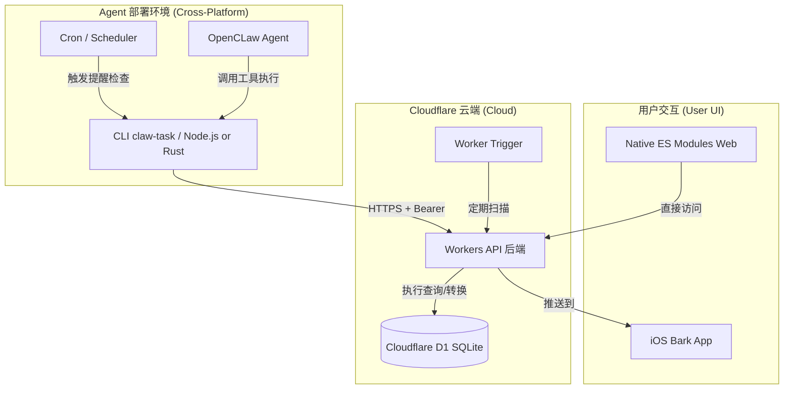

# 技术架构文档

## 系统架构图



## 核心设计规范

### 1. 跨平台 CLI (Node.js / Rust Binary)
- **双模运行**: 支持原生 Node.js 运行，或通过 **Rust** 编译为原生二进制以获得极速启动体验。
- **无 GUI 依赖**: 不调用特定 OS 的通知脚本。
- **Agent 通信**: 通过标准输出 (`stdout`) 返回结构化数据或调用 OpenCLaw 的 `system.notify` 接口。
- **高性能构建**: 使用 `cargo build --release` 实现零依赖分发，原生编译性能。
- **静默升级机制 (Rust专属)**: 
  - 在常规命令执行结束后，触发**脱离主进程 (detached process)** 的轻量级后台更新检查（每日限流一次）。
  - 通过 GitHub Releases API 对比本地 `semver`，并在后续执行中输出非阻塞更新提示。
  - 提供 `upgrade` 子命令，利用 `self-replace` 库实现二进制文件热替换、无缝安全升级。

### 2. 双触发机制 (Separated Trigger)
- **Agent Channel**: 本地触发，由 API 返回到期任务列表，本地完成通知。
- **Cloud Channel**: 云端触发，由 Worker 直接调用 Bark API 发送 iOS 推送。

### 3. AI 友好性组件
- **`/api/info`**: 提供 Schema 和配置的自发现。
- **CLI 发现与输出**: 移除对 `--help` 的环境依赖，加入全局 `--json` 输出参数以避免控制台排版对 AI 提取数据的干扰。
- **Metadata 处理器**: 在 API 层对任务的 `metadata` (JSON) 字段进行序列化与反序列化。
- **语义化搜索**: 在 D1 层通过关键词匹配 (`LIKE`) 支撑搜索能力。

### 4. 存储与转换 (Timezone & Normalization)
- **存储规范**: 数据库 (D1) 强制存储标准的 **ISO UTC** 时间戳字符串。
- **强制标准化 (Ingress Control)**:
  - **正则校验**: 使用扩展正则表达式支持 `T` 或 `空格` 作为日期时间的分隔符，并允许时区标识符为可选。
  - **时区补全 (服务端基准)**: 对于不带时区的字符串，系统根据 **服务端 Worker 的 `USER_TIMEZONE` 配置** 进行时区识别（缺省为北京时间）。这意味着即便客户端与服务端时区不一致，存储结果也始终以服务端定义的时区为准进行校准。
  - **强制转换**: 在执行 `INSERT/UPDATE` 前，后端通过 `new Date().toISOString()`（结合识别出的时区偏移量）将所有日期字段统一转化为 UTC 格式。
- **输出显示 (Egress Control)**:
  - **API 输出**: 原样返回 UTC 字符串。
  - **Web 端显示**: 前端在初始化时通过 `/api/info` 获取服务端配置的 `timezone`，并利用 `Intl.DateTimeFormat` 进行本地化渲染。即：展示时间随服务端配置走，而非随浏览器本地时区走。
  - **数据库对比**: 所有的到期提醒对比 (`remind_at <= CURRENT_TIMESTAMP`) 均基于数据库内置的 UTC 时间进行，确保提醒触发的一致性。

## 目录结构 (Finalized)
```
claw-owner-task/
├── src/
│   ├── worker/
│   │   ├── index.ts         # 路由入口 (Hono-like 或原生)
│   │   ├── middleware/
│   │   │   ├── auth.ts      # 强制 API Key 校验
│   │   │   └── timezone.ts  # I/O 时间转换
│   │   ├── db/
│   │   │   └── migrations/  # D1 迁移脚本 (001_tasks.sql 等)
│   │   ├── services/
│   │   │   ├── bark.ts      # Bark 推送集成
│   │   │   └── recurrence.ts # 周期逻辑计算
│   │   └── handlers/        # 各模块处理器
│   ├── web/                 # 前端 (无需构建步骤)
│   │   ├── index.html
│   │   └── js/app.js (ES Modules)
│   └── cli/                 # 跨平台 CLI (Node.js 版)
│       └── index.js (Commander.js)
├── cli-rust/                # 跨平台 CLI (Rust 高性能版)
│   ├── Cargo.toml
│   └── src/
│       ├── main.rs (Clap)
│       └── api.rs
├── wrangler.toml            # 配置 Worker & D1
└── package.json             # 后端与 CLI 的依赖管理
```

---
**版本**: 1.5.2
**更新时间**: 2026-03-03 23:25:00
**变更历史**:
- 1.5.2: 新增 Rust 版 CLI 静默版本检查和自动升级机制 (`upgrade` 子命令)。
- 1.4.0: 新增 Rust 高性能 CLI 实现，更新目录结构和架构图。
- 1.3.3: 补充 AI 友好度在 CLI 端的架构设计说明（CLI 自发现与机器友好输出）。
- 1.3.2: 明确 CLI 全局命令名为 `claw-task`。
- 1.3.1: 整合最终架构图、双触发机制及项目结构规范。
